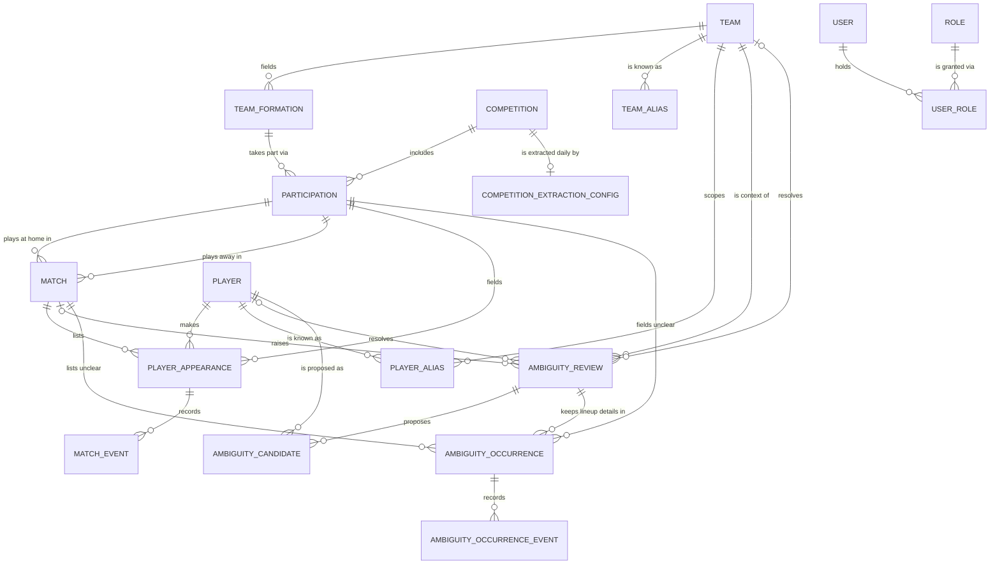

# Entity Model

## Entity Relationship Diagram

Every table except USER_ROLE carries the same four base columns (`id`, `version`, `created_at`, `last_updated`); they are listed in full for each entity.

### TEAM

A football club, independent of the age groups and senior teams it fields.

| Attribute    | Description                                  | Data Type | Length/Precision | Validation Rules      |
|--------------|----------------------------------------------|-----------|------------------|-----------------------|
| id           | Unique identifier                            | Long      | 19               | Primary Key, Sequence |
| version      | Optimistic locking counter                   | Integer   | 10               | Not Null              |
| created_at   | Time the row was created                     | DateTime  | -                | Not Null              |
| last_updated | Time the row was last changed                | DateTime  | -                | Not Null              |
| name         | Club name as shown in the tracker            | String    | 255              | Not Null              |
| location     | Town or city of the club                     | String    | 255              | Not Null              |
| logo_url     | Address of the club logo on the BFU site     | String    | 512              | Optional              |

### TEAM_FORMATION

One squad a club fields, either an age group or one of its senior teams.

| Attribute    | Description                                                  | Data Type | Length/Precision | Validation Rules                                               |
|--------------|--------------------------------------------------------------|-----------|------------------|----------------------------------------------------------------|
| id           | Unique identifier                                            | Long      | 19               | Primary Key, Sequence                                          |
| version      | Optimistic locking counter                                   | Integer   | 10               | Not Null                                                       |
| created_at   | Time the row was created                                     | DateTime  | -                | Not Null                                                       |
| last_updated | Time the row was last changed                                | DateTime  | -                | Not Null                                                       |
| team_id      | Club fielding the formation                                  | Long      | 19               | Not Null, Foreign Key (TEAM.id)                                |
| type         | Age group or senior team; FIRST has no suffix, SECOND "II", THIRD "III" | String | 10      | Not Null, Values: U15, U16, U17, U18, U19, FIRST, SECOND, THIRD |

#### Constraints

- A club fields at most one formation of each type (`team_id`, `type` unique).

### COMPETITION

A league or tournament whose matches are tracked.

| Attribute    | Description                                  | Data Type | Length/Precision | Validation Rules      |
|--------------|----------------------------------------------|-----------|------------------|-----------------------|
| id           | Unique identifier                            | Long      | 19               | Primary Key, Sequence |
| version      | Optimistic locking counter                   | Integer   | 10               | Not Null              |
| created_at   | Time the row was created                     | DateTime  | -                | Not Null              |
| last_updated | Time the row was last changed                | DateTime  | -                | Not Null              |
| name         | Name of the league or tournament             | String    | 255              | Not Null              |
| logo_url     | Address of the competition logo              | String    | 512              | Optional              |

### COMPETITION_EXTRACTION_CONFIG

The opt-in settings that make a competition part of the daily scheduled extraction; a competition without one is skipped.

| Attribute      | Description                                                         | Data Type | Length/Precision | Validation Rules                       |
|----------------|---------------------------------------------------------------------|-----------|------------------|----------------------------------------|
| id             | Unique identifier                                                   | Long      | 19               | Primary Key, Sequence                  |
| version        | Optimistic locking counter                                          | Integer   | 10               | Not Null                               |
| created_at     | Time the row was created                                            | DateTime  | -                | Not Null                               |
| last_updated   | Time the row was last changed                                       | DateTime  | -                | Not Null                               |
| competition_id | Competition extracted daily; at most one configuration per competition | Long   | 19               | Not Null, Foreign Key (COMPETITION.id) |
| fixtures_url   | Address of the competition's results page, already encoding the season | String | 512              | Not Null                               |
| current_season | Season used for the daily extraction, format YYYY/YYYY              | String    | 9                | Not Null                               |

#### Constraints

- `competition_id` is unique: a competition has at most one extraction configuration.

### PARTICIPATION

A team formation taking part in a competition in one season; matches and lineup entries refer to it.

| Attribute         | Description                                  | Data Type | Length/Precision | Validation Rules                          |
|-------------------|----------------------------------------------|-----------|------------------|-------------------------------------------|
| id                | Unique identifier                            | Long      | 19               | Primary Key, Sequence                     |
| version           | Optimistic locking counter                   | Integer   | 10               | Not Null                                  |
| created_at        | Time the row was created                     | DateTime  | -                | Not Null                                  |
| last_updated      | Time the row was last changed                | DateTime  | -                | Not Null                                  |
| team_formation_id | Formation taking part                        | Long      | 19               | Not Null, Foreign Key (TEAM_FORMATION.id) |
| competition_id    | Competition taken part in                    | Long      | 19               | Not Null, Foreign Key (COMPETITION.id)    |
| season            | Season, format YYYY/YYYY                     | String    | 9                | Not Null                                  |

#### Constraints

- A formation takes part in a competition at most once per season (`team_formation_id`, `competition_id`, `season` unique).

### MATCH

A match played on a date between two participations of the same competition and season.

| Attribute    | Description                                  | Data Type | Length/Precision | Validation Rules                         |
|--------------|----------------------------------------------|-----------|------------------|------------------------------------------|
| id           | Unique identifier                            | Long      | 19               | Primary Key, Sequence                    |
| version      | Optimistic locking counter                   | Integer   | 10               | Not Null                                 |
| created_at   | Time the row was created                     | DateTime  | -                | Not Null                                 |
| last_updated | Time the row was last changed                | DateTime  | -                | Not Null                                 |
| home_team_id | Home side                                    | Long      | 19               | Not Null, Foreign Key (PARTICIPATION.id) |
| away_team_id | Away side                                    | Long      | 19               | Not Null, Foreign Key (PARTICIPATION.id) |
| date         | Match date                                   | Date      | -                | Not Null                                 |
| home_score   | Goals scored by the home side, if known      | Integer   | 5                | Optional                                 |
| away_score   | Goals scored by the away side, if known      | Integer   | 5                | Optional                                 |

#### Constraints

- Home and away are different participations of the same competition and season (enforced by the application, not the database).

### PLAYER

A real person who has appeared in at least one tracked lineup or was entered by an Administrator.

| Attribute      | Description                                                              | Data Type | Length/Precision | Validation Rules      |
|----------------|--------------------------------------------------------------------------|-----------|------------------|-----------------------|
| id             | Unique identifier                                                        | Long      | 19               | Primary Key, Sequence |
| version        | Optimistic locking counter                                               | Integer   | 10               | Not Null              |
| created_at     | Time the row was created                                                 | DateTime  | -                | Not Null              |
| last_updated   | Time the row was last changed                                            | DateTime  | -                | Not Null              |
| names          | All of the player's names as one text                                    | String    | 255              | Not Null              |
| name_embedding | 768-dimension semantic vector of the name, filled in the background (UC-013) | BLOB  | 768              | Optional              |

### PLAYER_APPEARANCE

A player's entry in one side's lineup of one match.

| Attribute              | Description                                                       | Data Type | Length/Precision | Validation Rules                         |
|------------------------|-------------------------------------------------------------------|-----------|------------------|------------------------------------------|
| id                     | Unique identifier                                                 | Long      | 19               | Primary Key, Sequence                    |
| version                | Optimistic locking counter                                        | Integer   | 10               | Not Null                                 |
| created_at             | Time the row was created                                          | DateTime  | -                | Not Null                                 |
| last_updated           | Time the row was last changed                                     | DateTime  | -                | Not Null                                 |
| player_id              | Player in the lineup                                              | Long      | 19               | Not Null, Foreign Key (PLAYER.id)        |
| match_id               | Match of the lineup                                               | Long      | 19               | Not Null, Foreign Key (MATCH.id)         |
| participation_id       | Side the player played for; equals the match's home or away side  | Long      | 19               | Not Null, Foreign Key (PARTICIPATION.id) |
| starter                | Whether the player started the match                              | Boolean   | 1                | Not Null                                 |
| number                 | Shirt number                                                      | Integer   | 5                | Optional                                 |
| substituted_in_minute  | Minute the player came on, between 0 and 130                      | Integer   | 5                | Optional                                 |
| substituted_out_minute | Minute the player went off, between 0 and 130                     | Integer   | 5                | Optional                                 |

#### Constraints

- A player appears at most once per match (`player_id`, `match_id` unique).
- When both substitution minutes are set, `substituted_out_minute` is greater than `substituted_in_minute`.
- Each substitution minute, when set, lies between 0 and 130.

### MATCH_EVENT

A goal or card of a player in a match; deleted together with its lineup entry.

| Attribute            | Description                                  | Data Type | Length/Precision | Validation Rules                                                                  |
|----------------------|----------------------------------------------|-----------|------------------|-----------------------------------------------------------------------------------|
| id                   | Unique identifier                            | Long      | 19               | Primary Key, Sequence                                                             |
| version              | Optimistic locking counter                   | Integer   | 10               | Not Null                                                                          |
| created_at           | Time the row was created                     | DateTime  | -                | Not Null                                                                          |
| last_updated         | Time the row was last changed                | DateTime  | -                | Not Null                                                                          |
| player_appearance_id | Lineup entry the event belongs to            | Long      | 19               | Not Null, Foreign Key (PLAYER_APPEARANCE.id)                                      |
| type                 | Kind of event                                | String    | 20               | Not Null, Values: GOAL, PENALTY_GOAL, OWN_GOAL, YELLOW_CARD, SECOND_YELLOW_CARD, RED_CARD |
| minute               | Minute of the event, between 0 and 130       | Integer   | 5                | Optional                                                                          |

#### Constraints

- `minute`, when set, lies between 0 and 130.
- Deleting a PLAYER_APPEARANCE deletes its MATCH_EVENT rows; nothing else cascades.

### TEAM_ALIAS

A team name as written on an external site, remembered so that the same name is recognised directly next time.

| Attribute    | Description                                  | Data Type | Length/Precision | Validation Rules                     |
|--------------|----------------------------------------------|-----------|------------------|--------------------------------------|
| id           | Unique identifier                            | Long      | 19               | Primary Key, Sequence                |
| version      | Optimistic locking counter                   | Integer   | 10               | Not Null                             |
| created_at   | Time the row was created                     | DateTime  | -                | Not Null                             |
| last_updated | Time the row was last changed                | DateTime  | -                | Not Null                             |
| team_id      | Team the name refers to                      | Long      | 19               | Not Null, Foreign Key (TEAM.id)      |
| source       | Site the name was read from                  | String    | 20               | Not Null, Values: BFU_TOURNAMENTS, EBFU |
| raw_name     | Team name exactly as written on the site     | String    | 255              | Not Null                             |

#### Constraints

- A name on one site refers to exactly one team (`source`, `raw_name` unique).

### PLAYER_ALIAS

A player name as written on an external site under a given team, remembered so that it is identified directly next time; scoped by team because different players often share a name.

| Attribute    | Description                                         | Data Type | Length/Precision | Validation Rules                        |
|--------------|-----------------------------------------------------|-----------|------------------|-----------------------------------------|
| id           | Unique identifier                                   | Long      | 19               | Primary Key, Sequence                   |
| version      | Optimistic locking counter                          | Integer   | 10               | Not Null                                |
| created_at   | Time the row was created                            | DateTime  | -                | Not Null                                |
| last_updated | Time the row was last changed                       | DateTime  | -                | Not Null                                |
| player_id    | Player the name refers to                           | Long      | 19               | Not Null, Foreign Key (PLAYER.id)       |
| source       | Site the name was read from                         | String    | 20               | Not Null, Values: BFU_TOURNAMENTS, EBFU |
| raw_name     | Player name exactly as written on the site          | String    | 255              | Not Null                                |
| team_id      | Team the name was read under (not the player's current team) | Long | 19          | Not Null, Foreign Key (TEAM.id)         |

#### Constraints

- A name on one site under one team refers to exactly one player (`source`, `raw_name`, `team_id` unique).

### AMBIGUITY_REVIEW

An inbox item for a scraped player or team name the system could not identify with confidence, waiting for an Administrator's decision.

| Attribute          | Description                                                            | Data Type | Length/Precision | Validation Rules                         |
|--------------------|------------------------------------------------------------------------|-----------|------------------|------------------------------------------|
| id                 | Unique identifier                                                      | Long      | 19               | Primary Key, Sequence                    |
| version            | Optimistic locking counter                                             | Integer   | 10               | Not Null                                 |
| created_at         | Time the item was raised                                               | DateTime  | -                | Not Null                                 |
| last_updated       | Time the item was last changed                                         | DateTime  | -                | Not Null                                 |
| type               | Whether a player name or a team name is unclear                        | String    | 10               | Not Null, Values: TEAM, PLAYER           |
| raw_name           | Name exactly as written on the site                                    | String    | 255              | Not Null                                 |
| team_id            | Team the player name was read under, or the team a conflicting team name is currently mapped to | Long | 19 | Not Null, Foreign Key (TEAM.id) |
| match_id           | First saved match the name was raised in, references MATCH.id          | Long      | 19               | Optional                                 |
| source             | Site the name was read from                                            | String    | 20               | Not Null, Values: BFU_TOURNAMENTS, EBFU  |
| status             | Review state; DISMISSED is defined but never set                       | String    | 10               | Not Null, Values: PENDING, RESOLVED, DISMISSED |
| resolved_player_id | Player chosen for a PLAYER item, references PLAYER.id                  | Long      | 19               | Optional                                 |
| resolved_team_id   | Team chosen for a TEAM item, references TEAM.id                        | Long      | 19               | Optional                                 |
| resolved_at        | Time the item was resolved                                             | DateTime  | -                | Optional                                 |
| resolved_by        | Username of the Administrator who resolved the item                    | String    | 255              | Optional                                 |

#### Constraints

- A RESOLVED PLAYER item has `resolved_player_id`, `resolved_at` and `resolved_by`; a RESOLVED TEAM item has `resolved_team_id`, `resolved_at` and `resolved_by` (enforced by the application).
- At most one PENDING PLAYER item exists per `raw_name` and `team_id`, and at most one PENDING TEAM item per `raw_name` (enforced by the application).

### AMBIGUITY_CANDIDATE

A ranked player suggestion for a player inbox item; deleted together with its item.

| Attribute           | Description                                       | Data Type | Length/Precision | Validation Rules                              |
|---------------------|---------------------------------------------------|-----------|------------------|-----------------------------------------------|
| id                  | Unique identifier                                 | Long      | 19               | Primary Key, Sequence                         |
| version             | Optimistic locking counter                        | Integer   | 10               | Not Null                                      |
| created_at          | Time the row was created                          | DateTime  | -                | Not Null                                      |
| last_updated        | Time the row was last changed                     | DateTime  | -                | Not Null                                      |
| ambiguity_review_id | Inbox item the candidate belongs to               | Long      | 19               | Not Null, Foreign Key (AMBIGUITY_REVIEW.id)   |
| player_id           | Suggested player                                  | Long      | 19               | Not Null, Foreign Key (PLAYER.id)             |
| score               | Similarity score of the suggestion, normally 0–1  | Decimal   | 5,4              | Not Null                                      |

#### Constraints

- Deleting an AMBIGUITY_REVIEW deletes its AMBIGUITY_CANDIDATE rows; nothing else cascades.

### AMBIGUITY_OCCURRENCE

The lineup details of an unclear player name in one saved match, kept with its inbox item so that resolving the item adds the lineup entry.

| Attribute              | Description                                                       | Data Type | Length/Precision | Validation Rules                            |
|------------------------|-------------------------------------------------------------------|-----------|------------------|---------------------------------------------|
| id                     | Unique identifier                                                 | Long      | 19               | Primary Key, Sequence                       |
| version                | Optimistic locking counter                                        | Integer   | 10               | Not Null                                    |
| created_at             | Time the row was created                                          | DateTime  | -                | Not Null                                    |
| last_updated           | Time the row was last changed                                     | DateTime  | -                | Not Null                                    |
| ambiguity_review_id    | Inbox item the name belongs to                                    | Long      | 19               | Not Null, Foreign Key (AMBIGUITY_REVIEW.id) |
| match_id               | Match the name was listed in                                      | Long      | 19               | Not Null, Foreign Key (MATCH.id)            |
| participation_id       | Side the name was listed for; equals the match's home or away side | Long     | 19               | Not Null, Foreign Key (PARTICIPATION.id)    |
| starter                | Whether the name was listed as a starter                          | Boolean   | 1                | Not Null                                    |
| number                 | Shirt number                                                      | Integer   | 5                | Optional                                    |
| substituted_in_minute  | Minute the player came on, between 0 and 130                      | Integer   | 5                | Optional                                    |
| substituted_out_minute | Minute the player went off, between 0 and 130                     | Integer   | 5                | Optional                                    |

#### Constraints

- An inbox item keeps at most one set of lineup details per match (`ambiguity_review_id`, `match_id` unique).
- Each substitution minute, when set, lies between 0 and 130.
- Deleting an AMBIGUITY_REVIEW deletes its AMBIGUITY_OCCURRENCE rows; the rows stay after the item is resolved.

### AMBIGUITY_OCCURRENCE_EVENT

A goal or card read for an unclear player name in one match; deleted together with its occurrence.

| Attribute               | Description                                  | Data Type | Length/Precision | Validation Rules                                                                  |
|-------------------------|----------------------------------------------|-----------|------------------|-----------------------------------------------------------------------------------|
| id                      | Unique identifier                            | Long      | 19               | Primary Key, Sequence                                                             |
| version                 | Optimistic locking counter                   | Integer   | 10               | Not Null                                                                          |
| created_at              | Time the row was created                     | DateTime  | -                | Not Null                                                                          |
| last_updated            | Time the row was last changed                | DateTime  | -                | Not Null                                                                          |
| ambiguity_occurrence_id | Occurrence the event belongs to              | Long      | 19               | Not Null, Foreign Key (AMBIGUITY_OCCURRENCE.id)                                   |
| type                    | Kind of event                                | String    | 20               | Not Null, Values: GOAL, PENALTY_GOAL, OWN_GOAL, YELLOW_CARD, SECOND_YELLOW_CARD, RED_CARD |
| minute                  | Minute of the event, between 0 and 130       | Integer   | 5                | Optional                                                                          |

#### Constraints

- `minute`, when set, lies between 0 and 130.
- Deleting an AMBIGUITY_OCCURRENCE deletes its AMBIGUITY_OCCURRENCE_EVENT rows; nothing else cascades.

### ROLE

A permission level a user can hold; the installation provides ADMIN and USER.

| Attribute    | Description                                  | Data Type | Length/Precision | Validation Rules      |
|--------------|----------------------------------------------|-----------|------------------|-----------------------|
| id           | Unique identifier                            | Long      | 19               | Primary Key, Sequence |
| version      | Optimistic locking counter                   | Integer   | 10               | Not Null              |
| created_at   | Time the row was created                     | DateTime  | -                | Not Null              |
| last_updated | Time the row was last changed                | DateTime  | -                | Not Null              |
| name         | Role name, ADMIN or USER                     | String    | 50               | Not Null, Unique      |

### USER

A person who can sign in to the tracker.

| Attribute    | Description                                              | Data Type | Length/Precision | Validation Rules      |
|--------------|----------------------------------------------------------|-----------|------------------|-----------------------|
| id           | Unique identifier                                        | Long      | 19               | Primary Key, Sequence |
| version      | Optimistic locking counter                               | Integer   | 10               | Not Null              |
| created_at   | Time the row was created                                 | DateTime  | -                | Not Null              |
| last_updated | Time the row was last changed                            | DateTime  | -                | Not Null              |
| username     | Sign-in name                                             | String    | 255              | Not Null, Unique      |
| password     | Password in non-reversible form                          | String    | 255              | Not Null              |

### USER_ROLE

Assignment of a role to a user.

| Attribute | Description            | Data Type | Length/Precision | Validation Rules                  |
|-----------|------------------------|-----------|------------------|-----------------------------------|
| user_id   | User holding the role  | Long      | 19               | Primary Key, Foreign Key (USER.id) |
| role_id   | Role held              | Long      | 19               | Primary Key, Foreign Key (ROLE.id) |

#### Constraints

- (`user_id`, `role_id`) is the composite primary key.
